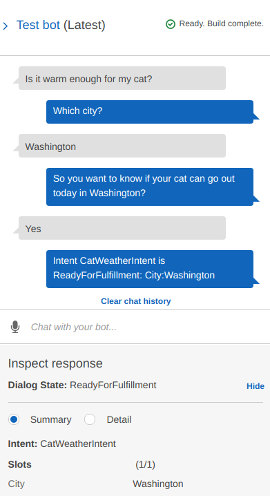

Amazon Lex chatbot
------------------

Sample `Amazon Lex`_ chatbot based on `AWS Fundamentals: Building Serverless
Applications`_ course exercise but using Pulumi to provision the AWS resources.

.. _`Amazon Lex`: https://aws.amazon.com/lex/
.. _`AWS Fundamentals: Building Serverless Applications`: https://www.coursera.org/learn/aws-fundamentals-building-serverless-applications

Create Pulumi project and stack
-------------------------------

.. code-block:: bash

   export AWS_PROFILE=pasmen
   pulumi login --cloud-url s3://pulumi.linhart.tech
   pulumi new aws-python --dir infra

Provide these values:

- *project name*: aws-lex-chatbot
- *project description*: Sample chatbot using Amazon Lex
- *stack name*: aws-lex-chatbot-prod
- *passphrase*: <secret-passphrase>
- *aws:region*: eu-central-1

.. code-block:: bash

   export PULUMI_CONFIG_PASSPHRASE=<secret-passphrase>
   cd infra
   pulumi config set aws:profile pasmen

   vim __main__.py

Manage the stack
----------------

- ``pulumi up`` - Create or update the resources in a stack
- ``pulumi stack output [<property-name>]`` - Show a stack's output properties
- ``pulumi destroy`` - Destroy an existing stack and its resources
- ``pulumi stack rm [<stack-name>]`` - Remove a stack and its configuration

Resources
---------

- https://www.coursera.org/learn/aws-fundamentals-building-serverless-applications
- https://aws.amazon.com/lex/
- https://www.pulumi.com/docs/get-started/aws/
- https://www.pulumi.com/docs/reference/pkg/aws/lex/
